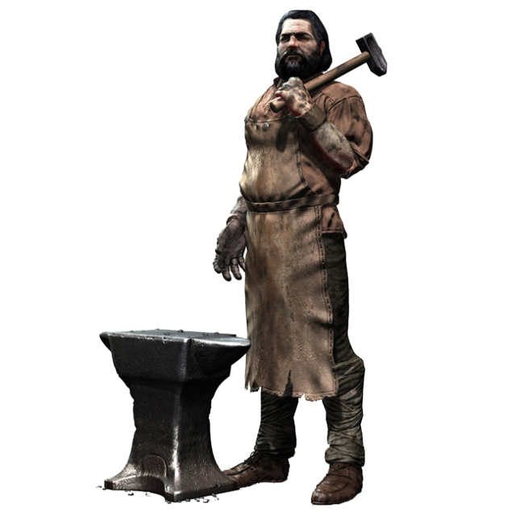
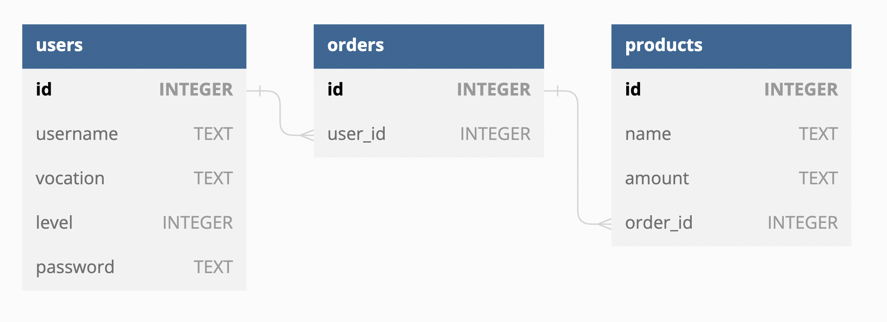

# Repositório do projeto TrybeSmith 

<div align="center">
  
  <div align="left" style="display: inline_block">
    <h2>Módulo: BACK-END</h2>
    <p>
        Repositório possui projeto desenvolvido no período que estive na <b>Trybe</b>, abordando os conceitos de <b>RESTFul API</b> com CRUD completo utilizando arquitetura Model-Service-Controller (MSC) usando TypeScript. 
  </div>
  <br>
</div>
  
## Informações de aprendizados
- Este é um projeto desenvolvido para me ajudar a aprender sobre sequelize e JWT.
- Meu primeiro projeto usando `sequelize` e `JWT`

---

### Linguagem usadas

![JavaScript][JavaScript.io]

[![NodeJS][NodeJS.io]][NodeJS-url]

[![Express][Express.io]][Express-url]

[![JWT][JWT.io]][JWT-url]

[![MySQL][MySQL.io]][MySQL-url]

[![Sequelize][Sequelize.io]][Sequelize-url]

[![Docker][Docker.io]][Docker-url]

---

## O que foi desenvolvido
<p> 
 Uma API e um banco de dados, utilizando a arquitetura MSC (model-service-controller), para a produção de conteúdo para um blog! <br>
 
 1. Desenvolvi endpoints que estarão conectados ao banco de dados seguindo os princípios do REST;<br>
 2. Para fazer um post é necessário usuário e login, portanto foi trabalhada a relação entre user e post; <br>
 3. Será necessária a utilização de categorias para os posts, trabalhando, assim, a relação de posts para categories e de categories para posts. <br>
</p>

---

## Variáveis de Ambiente

Para rodar esse projeto, atente-se as variáveis de ambiente no seu .env

---

### Instruções para instalar e rodar

1. Clone o repo:
```
  git clone git@github.com:Ludson96/project-blogs-api.git
```
2. Já existe um arquivo docker-compose.yml (Disponibilizado pela Trybe). Bastando usar o comando docker-compose up para rodar o MySQL e o Node pelo docker. Execute os services do docker: `node` e `db` 
```
  docker-compose up -d
```
3. Inicie o container node (renomeado para blogs_api):
```
  docker exec -it blogs_api bash
```
4. Instale as suas dependencias:
```
  npm install
```
5. Execute o servidor:

```
  npm start
```
Outra forma de executar é utilizando o `nodemom` (permite fazer alteração em tempo real sem precisar derrubar o servidor e iniciá-lo novamente):
```
  npm run debug
```
6. Utilizar alguma Plataforma de API para acessar os endpoints e fazer seus devidos experimentos. Exemplos: Postman e Insomnia. Ou uma extensão no VSCode, recomendo utlizar a thunder client.

7. Uso

- utiline o comando `npm run prestart`, ele criará o banco de dados e as tabelas de acordo com o que está em `/migrations` e `/seeders` .

- Todas as rotas (exceto `post /login` e `post /user` ) requerem autenticação

---

## Diagrama



<i> Imagem disponibilizada pela Trybe </i>

---

## Endpoints

<details>

###  Rota de Login

####  POST `/login`
- Entrar
- O corpo deve ser o seguinte:
```json
{
  "email" : " exemplo@email.com " ,
  "senha" : " 123456 "
}
```
  - Retorna um token se o login for concluído

###  Rota do Usuário

####  POST `/usuário`
- Cria um novo usuário
- O corpo deve ser o seguinte, onde:
  -  `displayName` deve ter pelo menos 8 caracteres
  -  `email` deve ter um formato válido
  -  `password` deve ter pelo menos 6 caracteres
  -  `imagem` é opcional
```json
{
  "displayName" : " John Doe " ,
  "email" : " exemplo@email.com " ,
  "senha" : " 123456 " ,
  "image" : " https://cdn1.iconfinder.com/data/icons/users-solid-1/30/users-solid-profile-neutral-5-512.png "
}
```
- Se o usuário for criado com sucesso, um token é fornecido

####  GET `/usuário`
- Lista todos os usuários:
```json
[
  {
    "id" : 1 ,
    "displayName" : " Lewis Hamilton " ,
    "email" : " lewishamilton@gmail.com " ,
    "image" : " https://upload.wikimedia.org/wikipedia/commons/1/18/Lewis_Hamilton_2016_Malaysia_2.jpg "
  },
  /* ... */
]
```

####  GET `/user/:id`
- Pega um parâmetro numérico, e se houver algum usuário com id correspondente, retorna:
```json
{
  "id" : 3 ,
  "displayName" : " John Doe " ,
  "email" : " exemplo@email.com " ,
  "image" : " https://cdn1.iconfinder.com/data/icons/users-solid-1/30/users-solid-profile-neutral-5-512.png "
}
```

####  DELETE `/user/me`
- Exclui o usuário atual
- Se o usuário for excluído com sucesso, o status `204` é retornado

###  Categorias Rota

####  POST `/categorias`
- Cria uma nova categoria
- O corpo deve ser o seguinte:
```json
{
  "name" : " Truques de mágica "
}
```

####  GET `/categorias`
- Lista todas as categorias:
```json
[
  {
      "id" : 1 ,
      "nome" : " Animais "
  },
  {
      "id" : 2 ,
      "nome" : " Livros "
  },
  /* ... */
]
```

###  Pós Rota

####  POST `/post`
- Cria uma nova postagem no blog
- O corpo deve ser o seguinte:
```json
{
  "title" : " Resenha: A arte da columbofilia " ,
  "content" : " Este é um ótimo livro sobre como os pombos podem ser treinados para se tornarem campeões! " ,
  "categoryIds" : [ 1 , 2 ]
}
```

####  GET `/post`
- Lista todas as postagens do blog:
```json
[
  {
    "id" : 1 ,
    "title" : " As melhores raças de cães para caça " ,
    "content" : " Aqui estão os melhores companheiros de caça " ,
    "userId" : 1 ,
    "publicado" : " 2011-08-01T19:58:00.000Z " ,
    "atualizado" : " 2011-08-01T19:58:51.000Z " ,
    "usuário" : {
      "id" : 1 ,
      "displayName" : " Lewis Hamilton " ,
      "email" : " lewishamilton@gmail.com " ,
      "image" : " https://upload.wikimedia.org/wikipedia/commons/1/18/Lewis_Hamilton_2016_Malaysia_2.jpg "
    },
    "categorias" : [
      {
        "id" : 1 ,
        "nome" : " Animais "
      }
    ]
  },
  
  /* ... */
]
```

####  GET `/post/:id`
- Pega um parâmetro numérico, e se houver algum post com um id correspondente, retorna:
```json
{
  "id" : 1 ,
  "title" : " As melhores raças de cães para caça " ,
  "content" : " Aqui estão os melhores companheiros de caça " ,
  "userId" : 1 ,
  "publicado" : " 2011-08-01T19:58:00.000Z " ,
  "atualizado" : " 2011-08-01T19:58:51.000Z " ,
  "usuário" : {
      "id" : 1 ,
      "displayName" : " Lewis Hamilton " ,
      "email" : " lewishamilton@gmail.com " ,
      "image" : " https://upload.wikimedia.org/wikipedia/commons/1/18/Lewis_Hamilton_2016_Malaysia_2.jpg "
  },
  "categorias" : [
      {
          "id" : 1 ,
          "nome" : " Animais "
      }
  ]
}
```

####  GET `/post/search?q=:searchTerm`
- Pesquisa postagens por título ou conteúdo, por exemplo:
```json
  // GET /post/search?q=silk
  [
    {
      "id" : 2 ,
      "title" : " Ótimos livros sobre a Rota da Seda " ,
      "content" : " Estes são alguns livros obrigatórios sobre a Rota da Seda " ,
      "userId" : 1 ,
      "publicado" : " 2011-08-01T19:58:00.000Z " ,
      "atualizado" : " 2011-08-01T19:58:51.000Z " ,
      "usuário" : {
        "id" : 1 ,
        "displayName" : " Lewis Hamilton " ,
        "email" : " lewishamilton@gmail.com " ,
        "image" : " https://upload.wikimedia.org/wikipedia/commons/1/18/Lewis_Hamilton_2016_Malaysia_2.jpg "
      },
      "categorias" : [
        {
          "id" : 2 ,
          "nome" : " Livros "
        }
      ]
    }
  ]
```
- Se não houver parâmetro de consulta, retorna todos os posts:
```json
  // GET /post/search?q=
  [
    {
      "id" : 1 ,
      "title" : " As melhores raças de cães para caça " ,
      "content" : " Aqui estão os melhores companheiros de caça " ,
      "userId" : 1 ,
      "publicado" : " 2011-08-01T19:58:00.000Z " ,
      "atualizado" : " 2011-08-01T19:58:51.000Z " ,
      "usuário" : {
        "id" : 1 ,
        "displayName" : " Lewis Hamilton " ,
        "email" : " lewishamilton@gmail.com " ,
        "image" : " https://upload.wikimedia.org/wikipedia/commons/1/18/Lewis_Hamilton_2016_Malaysia_2.jpg "
      },
      "categorias" : [
        {
          "id" : 1 ,
          "nome" : " Cães "
        }
      ]
    },
    
    /* ... */
  ]
```

####  COLOQUE `/post/:id`
- Edita uma postagem existente
- O corpo deve ser o seguinte, onde:
  - não é possível alterar a categoria
  - somente o **autor** pode editar a postagem
```json
{
  "title" : " Como fazer crescer as plantas da sua casa " ,
  "content" : " Este é um guia passo a passo para melhorar o crescimento de plantas em ambientes internos "
}
```

####  APAGAR `/post/:id`
- Exclui uma postagem existente
- Somente o autor pode deletar o post
- Se a postagem for excluída com sucesso, retorna o status `204`


</details>

> `docker-compose.yml`, `config.js` e `/seeders` arquivos providos pela Trybe.

[JavaScript.io]: https://img.shields.io/badge/javascript-F7DF1E?style=flat-square&logo=javascript&logoColor=black
[Express.io]: https://img.shields.io/badge/express-000000?style=flat-square&logo=express&logoColor=white
[Express-url]: https://expressjs.com
[Sequelize.io]: https://img.shields.io/badge/sequelize-52B0E7?style=flat-square&logo=sequelize&logoColor=white
[Sequelize-url]: https://sequelize.org
[JWT.io]: https://img.shields.io/badge/jwt-000000?style=flat-square&logo=jsonwebtokens&logoColor=white
[JWT-url]: https://jwt.io
[NodeJS.io]: https://img.shields.io/badge/node.js-339933?style=flat-square&logo=node.js&logoColor=white
[NodeJS-url]: https://nodejs.org/en/
[MySQL.io]: https://img.shields.io/badge/mysql-4479A1?style=flat-square&logo=mysql&logoColor=white
[MySQL-url]: https://www.mysql.com
[Docker.io]: https://img.shields.io/badge/docker-2496ED?style=flat-square&logo=docker&logoColor=white
[Docker-url]: https://www.docker.com
